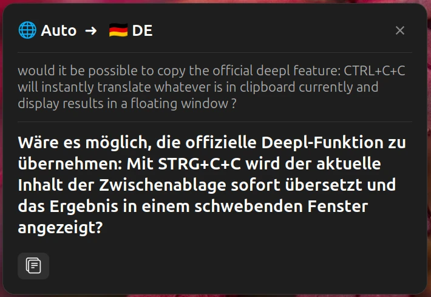

<p align="right"><a href="README.md">English</a> | <a href="README.zh-CN.md"><b>简体中文</b></a></p>

# Fast Translate —— 本地维护分支

双击复制，即时翻译 —— 在 GNOME Shell 中直接使用 Google 翻译与 DeepL。


[](https://github.com/SHADE-glitch/fast-translate)

## 项目说明

本仓库是 **Fast Translate** 的**个人维护分支**，而 Fast Translate 本身又是 [Lorenzo Carbonell（atareao）](https://github.com/atareao) 的原始项目 [**translate-assistant**](https://github.com/atareao/translate-assistant) 的现代化分支。

分支脉络：

```
atareao/translate-assistant  →  tazztone/fast-translate  →  本分支 (fast-translate@local)
```

本项目**与两位上游作者均无关**，也未获得其背书。本分支将扩展收敛为单一而专注的工作流——**翻译你刚刚复制的内容**——并加以强化：LRU 缓存、请求看门狗、精确的自回声抑制，以及修复 DeepL 区域语言代码问题。

## 功能特性

- **双击复制即时翻译** —— 正常复制文本后，在约 500ms 内再按一次 `Ctrl+C` 即可翻译。无需菜单，无需切换窗口。
- **浮动翻译窗口** —— 可拖动、自动居中的弹窗，显示源语言与目标语言，带**交换**与**复制**按钮，可选自动复制。
- **后台模式** —— 静默翻译并直接把结果写入剪贴板，随时可粘贴，可选桌面提示通知。
- **四种后端** —— **Google 翻译**（无需 API Key，开箱即用）、**DeepL**（免费版与专业版），以及 **百度** / **有道**（各自需要凭据）。
- **内联语言选择** —— 偏好设置中的旗帜 emoji 网格。
- **健壮性** —— LRU 翻译缓存（50 条）、12 秒请求看门狗、原生 `St.Spinner` 加载态、友好的网络错误提示，以及精确的自回声抑制，确保你自己的复制不会被误判为新输入。

## 截图



## 前置依赖

| 依赖 | 说明 |
|---|---|
| 操作系统 | Ubuntu（已在 Ubuntu 26.04 验证）——其他发行版**未验证** |
| GNOME Shell | 45 – 50 |
| 构建工具 | `glib-compile-schemas`（来自 `libglib2.0-bin`）与 `msgfmt`（来自 `gettext`）——克隆后需运行一次，用于编译 GSettings schema 与翻译 |
| API Key | 可选——**Google 翻译**无需 Key；**DeepL**、**百度**与**有道**各自需要凭据 |

## 安装

本仓库**就是**扩展本体：把它克隆进扩展目录，再编译两个未纳入版本控制的构建产物——GSettings schema 与翻译。

```bash
# Ubuntu 构建依赖
sudo apt install libglib2.0-bin gettext

git clone https://github.com/SHADE-glitch/fast-translate.git ~/.local/share/gnome-shell/extensions/fast-translate@local
cd ~/.local/share/gnome-shell/extensions/fast-translate@local

glib-compile-schemas schemas/
for f in po/*.po; do
    lang=$(basename "$f" .po)
    mkdir -p "locale/$lang/LC_MESSAGES"
    msgfmt "$f" -o "locale/$lang/LC_MESSAGES/fast-translate@tazztone.github.io.mo"
done

gnome-extensions enable fast-translate@local
```

在 Wayland 下需注销后重新登录，GNOME Shell 才会加载扩展。

若要改为生成可分发的 zip，请运行 `bash scripts/pack.sh`——它会编译 schema 与翻译，并通过临时目录打包。

> [!WARNING]
> 切勿在仓库目录内运行 `gnome-extensions install` 或 `gnome-extensions pack` —— 安装工具会跟随符号链接并可能清空源码目录。请使用 `scripts/pack.sh`，它通过临时目录打包。

### 卸载

```bash
gnome-extensions disable fast-translate@local
rm -rf ~/.local/share/gnome-shell/extensions/fast-translate@local
```

## 使用

复制任意文本，然后在约 500ms 内再按一次 `Ctrl+C`。

- **浮动窗口模式（默认）：** 弹出翻译结果，不抢占焦点、不使屏幕变暗。
- **后台模式：** 静默翻译并替换剪贴板内容；用 `Ctrl+V` 粘贴。可选提示通知会在完成时弹出。

面板图标仅暴露一个 **设置** 入口。

## 偏好设置

打开 **GNOME 设置 → 扩展 → Fast Translate → 设置**，可配置：

- 当前服务（Google 翻译、DeepL、百度或有道）
- 各服务商凭据（DeepL API Key 与 URL、百度 APP ID 与密钥、有道应用 ID 与密钥）——仅在选择对应服务时显示
- 默认源语言与目标语言
- 双击复制行为，包括后台模式与完成提示
- 格式与主题选项

## 相对上游的改动

本分支移除了原面板菜单翻译器与可配置的全局快捷键，仅保留双击复制工作流，并新增可靠性改进。提交数**有意不写死**——`git rev-list --count 420251c..HEAD` 才是权威（`420251c` 是本分支历史的起点，即冻结上游版本的导入提交）。

- **移除：** 面板菜单翻译 UI（输入/输出框、翻译按钮、错误标签、语言选择弹层）、全局快捷键（`shortcut-enabled`），以及面板自动粘贴 / 自动翻译 / 自动复制。
- **四种翻译服务：** `translation-helper.js` 中的服务商注册表（DeepL、Google、百度、有道），各自拥有语言代码映射、字符上限与请求规格；另有一个纯函数 `signing.js`，在 GJS 与 Node 下算出完全一致的百度 MD5 与有道 v3 签名。
- **可靠性：** LRU 翻译缓存（上限 50 条）、12 秒请求看门狗（含可重入启用守卫与请求代际取消）、基于「最后一次内部复制文本」的精确自回声抑制、原生 `St.Spinner` 加载态（加载中禁用复制按钮）、友好的传输/HTTP 错误提示，以及逐个处理器的 `destroy()` 守卫——中途抛错不再永久泄漏指示器。
- **弹窗：** `Esc` 关闭、加载态与开合动画；状态诚实化（加载中复制按钮置灰、失败后就地重试、修复 `Source ID` critical）；遮罩与卡片按显示器 work area 定位，多显示器不再误吞点击；通过两套变体样式表跟随浅/深色与系统强调色。
- **性能：** 长文本卡片高度从 710px 降到 441px（占 work area 96% → 60%）；揭示 settle 轮数从 9 轮降到 3 轮，并消除高度棘轮。
- **清理 / i18n：** 移除全局 `.popup-menu-content` 阴影覆盖与 259 行死 CSS（457 → 198 行，类与 JS 1:1）；去掉中文硬编码；`Gtk` 导入钉 `?version=4.0`。
- **修复：** DeepL 会以 400 拒绝 `EN-US` / `PT-BR` 这类区域语言代码 —— 现在会在语言交换后归一化（`EN-US` → `EN`，`PT-BR` → `PT`）。
- **偏好设置：** 移除「Panel Menu Automation」分组，新增各服务商凭据分组，并重排其余分组。
- **测试：** 单元测试覆盖新增的纯函数（含 GJS/Node 签名交叉校验）；评估测试断言面板 UI 与快捷键已不存在。

## 参与贡献

1. Fork 本仓库。
2. 新建分支：`git checkout -b <branch_name>`。
3. 提交改动：`git commit -m '<commit_message>'`。
4. 推送分支并创建 Pull Request。

运行测试：`npm test`（Node 单元测试，外加 GJS 偏好设置布局校验）。

## 致谢与来源说明

本扩展是 **Lorenzo Carbonell Cerezo（atareao）** 的原始项目 **Translate Assistant** 的分支，后经 **tazztone** 现代化为 **Fast Translate**。

- **原始上游：** [atareao/translate-assistant](https://github.com/atareao/translate-assistant)，作者 Lorenzo Carbonell Cerezo —— 许可证 **MIT**
- **现代化上游：** [tazztone/fast-translate](https://github.com/tazztone/fast-translate) —— 许可证 **MIT**
- **原始贡献者：** Philipp Kiemle（daPhipz）、Fabrício Müller（fabricio8800）、Heimen Stoffels（Vistaus）、Lorenzo Carbonell（atareao）
- **上游（本分支之前）引入的功能：** Google 翻译默认后端、`Ctrl+C` `Ctrl+C` 双击即时翻译、后台模式、内联旗帜 emoji 网格、高 DPI 缩放与集成测试。

## 许可证

本项目采用 **MIT 许可证** —— 见 [LICENSE](LICENSE)。

© Lorenzo Carbonell Cerezo（atareao）、tazztone 及贡献者；分支修改 © SHADE-glitch。
